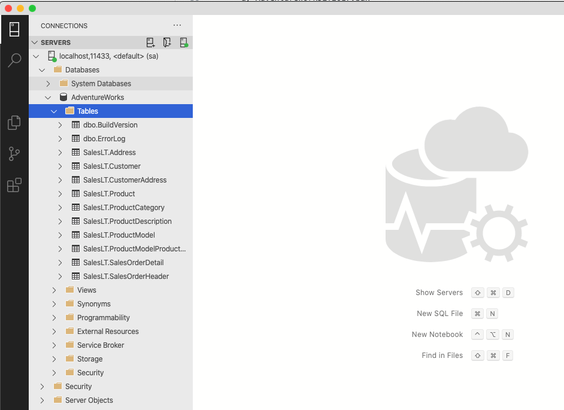

## How to run Ms sql server on Mac using docker 
How to run Ms sql server on Mac using docker 

## Prerequisites
  - Mac computer (Latest version on macOS)
  - Create a folder (e.g. users/`username`/docker/mssqlserver)
  - Download AdventureWorksLT2017.bak and place it inside above folder.
    - Database backup file can be found https://github.com/Microsoft/sql-server-samples/releases/tag/adventureworks
    - Make sure to download AdventureWorksLT (Lightweight) full database backups
  - VS Code
  - Download and Install Azure Data Studio. This will allow us to connect sql server.

## Open above folder (mssqlserver) in VS code
  - Terminal : cd into above folder
  - type `code .` it will open VS code
  - add new file 'restore-backup.sql'
  - add new file 'dockerfile' (without any extension)


## 'restore-backup.sql'
```SQL
RESTORE DATABASE [AdventureWorks] FROM DISK ='/tmp/AdventureWorksLT2017.bak'
WITH FILE=1,
MOVE 'AdventureWorksLT2012_Data' TO '/var/opt/mssql/data/AdventureWorks.mdf',
MOVE 'AdventureWorksLT2012_Log' TO '/var/opt/mssql/data/AdventureWorks.ldf',
NOUNLOAD, REPLACE, STATS=5
GO
```

## 'dockerfile'
```dockerfile

FROM mcr.microsoft.com/mssql/server:2017-latest AS build
ENV ACCEPT_EULA=Y
ENV SA_PASSWORD=Password@1

WORKDIR /tmp
COPY AdventureWorksLT2017.bak .
COPY restore-backup.sql .

RUN /opt/mssql/bin/sqlservr --accept-eula & sleep 10 \
  && /opt/mssql-tools/bin/sqlcmd -S localhost -U SA -P "strongPwd@1" -i /tmp/restore-backup.sql \
  && pkill sqlservr

FROM mcr.microsoft.com/mssql/server:2017-latest AS release

ENV ACCEPT_EULA=Y

COPY --from=build /var/opt/mssql/data /var/opt/mssql/data


```

## Lets build docker image
  - Note: Following three files should be in same location (e.g. users/`username`/docker/mssqlserver)
    - a) AdventureWorksLT2017.bak
    - b) dockerfile
    - c) restore-backup.sql
 
 - Open Terminal and make sure you are in 'mssqlserver' folder and run following command
 
   - `docker build -t restored-db:latest .`
   - docker image has been created and name of the image is `restored-db:latest`

## Lets Create docker container using this image

  - type following command in terminal
  - `docker run --name msqlserver-dev -p 11433:1433 -d restored-db`
  - docker container is created and now sql server is running and it has AdventureWorks database.
  - Veryfy whether or not container is running, type following command
  - `docker ps` it will list all the running container on your machine. look for the `mssqlserver-dev`
  
## Lets connect this SQL server using Azure Data Studio
  - Open Azure Data Studio
  - Server : `localhost,11433`
  - User Name: `sa`
  - Password: `strongPwd@1`
  - click on Connect button
 
 
 

  
 

