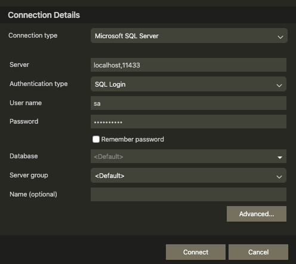
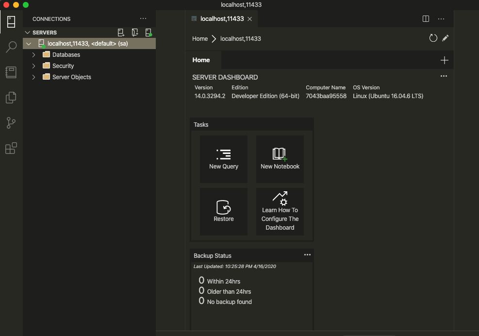

## How to run Ms sql server on Mac using docker 
How to run Ms sql server on Mac using docker 

## Prerequisites
  - Mac computer (Latest version on macOS)
  - Download and Install Docker Desktop for Mac (https://hub.docker.com/editions/community/docker-ce-desktop-mac)
  - Create a folder (e.g. users/`username`/docker/mssqlserver)
  - Download AdventureWorksLT2017.bak and place it inside above folder.
    - Database backup file can be found https://github.com/Microsoft/sql-server-samples/releases/tag/adventureworks
    - Make sure to download AdventureWorksLT (Lightweight) full database backups
  - VS Code
  - Download and Install Azure Data Studio. This will allow us to connect sql server.

## Open above folder (mssqlserver) in VS code
  - Terminal : cd into above folder
  - type `code .` it will open VS code
  - add new file `restore-backup.sql`
  - add new file `dockerfile` (without any extension)


## 'restore-backup.sql'
```SQL
RESTORE DATABASE [AdventureWorks] FROM DISK ='/tmp/AdventureWorksLT2017.bak'
WITH FILE=1,
MOVE 'AdventureWorksLT2012_Data' TO '/var/opt/mssql/data/AdventureWorks.mdf',
MOVE 'AdventureWorksLT2012_Log' TO '/var/opt/mssql/data/AdventureWorks.ldf',
NOUNLOAD, REPLACE, STATS=5
GO
```

## 'dockerfile'
```dockerfile

FROM mcr.microsoft.com/mssql/server:2017-latest AS build
ENV ACCEPT_EULA=Y
ENV SA_PASSWORD=strongPwd@1

WORKDIR /tmp
COPY AdventureWorksLT2017.bak .
COPY restore-backup.sql .

RUN /opt/mssql/bin/sqlservr --accept-eula & sleep 10 \
  && /opt/mssql-tools/bin/sqlcmd -S localhost -U SA -P "strongPwd@1" -i /tmp/restore-backup.sql \
  && pkill sqlservr

FROM mcr.microsoft.com/mssql/server:2017-latest AS release

ENV ACCEPT_EULA=Y

COPY --from=build /var/opt/mssql/data /var/opt/mssql/data


```

## Lets build docker image
  - Note: Following three files should be in same location (e.g. users/`username`/docker/mssqlserver)
    - a) AdventureWorksLT2017.bak
    - b) dockerfile
    - c) restore-backup.sql
 
 - Open Terminal and make sure you are in 'mssqlserver' folder and run following command
 
   - `docker build -t restored-db:latest .`
   - docker image has been created and name of the image is `restored-db:latest`

## Lets Create docker container using this image

  - type following command in terminal
  - `docker run --name msqlserver-dev -p 11433:1433 -d restored-db`
  - docker container is created and now sql server is running and it has AdventureWorks database.
  - Veryfy whether or not container is running, type following command
  - `docker ps` it will list all the running container on your machine. look for the `mssqlserver-dev`

  
## Lets interact with SQL server (Termianl)

  - Check if your sql server is running in container, if not start the container
  - `docekr ps`
  - Get the container id (e.g. 5cfbb6a2f91a)
  - Type following command
    - `docker exec -it 5cfbb6a2f91a /opt/mssql-tools/bin/sqlcmd -S localhost -U SA -P 'strongPwd@1'`
  - If you see` 1>` , means you are connected
  
  - Display the database name
    - `SELECT NAME FROM SYS.SYSDATABASES;` <press enter>
    - `GO` <press enter>

  - Use databse
    - `USE AdventureWorks`
    - `GO`
  - Show all the tables in database
    - `SELECT * FROM INFORMATION_SCHEMA.TABLES;`
    - `GO`
    
  - Select table row
    - `SELECT TOP 100 * FROM SalesLT.customer;`
    - `GO`

 
  
## Lets connect SQL server using Azure Data Studio
  - Open Azure Data Studio
  - Server : `localhost,11433`
  - User Name: `sa`
  - Password: `strongPwd@1`
  - click on Connect button
 
 
 

  
# Presist SQL Server Data on Mac

Since external location is not allowed for MS SQL server on mac, we need to create a volume inside docker host
Note: DO NOT remove the volume.
If we remove the volume, it will remove all the data that is inside the volume. 
However, we can delete sql container which will not delete the data if you have mounted this volume.

https://docs.microsoft.com/en-us/sql/linux/sql-server-linux-configure-docker?view=sql-server-2017#persist

### Create a volume inside hocker host

`docker volume create mssqldata`

Note: DO NOT Delete this volume since we are going to use to store sql server data.

`docker volume ls` -> view all the volumes on docker host

`docker volume rm <volume_name>` -> remove volume

### Create SQL container 

`docker run -e 'ACCEPT_EULA=Y' -e 'SA_PASSWORD=strong@password1' --name sqlmusic -p 11433:1433 -v mssqldata:/var/opt/mssql/data -d mcr.microsoft.com/mssql/server:2017-latest`

### Copy .bak file into container


`docker cp <your_computer_directory>/AdventureWorksLT2017.bak sqlmusic:/var/opt/mssql/data/AdventureWorksLT2017.bak`


`docker cp /Users/<username>/Backups/AdventureWorksLT2017.bak sqlmusic:/var/opt/mssql/data/AdventureWorksLT2017.bak`

### Connect sql server using Azure Data Studio and restore the database
  - Open Azure Data Studio and connect the sql server
  
  
  
  - right click on server name and click on manage
  
  
  
  
  - click on Restore 
  - Source : Restore from = Backup file
  - Backup file path : /var/opt/mssql/data/AdventureWorksLT2017.bak
  - click on OK
  - click on Restore
   


